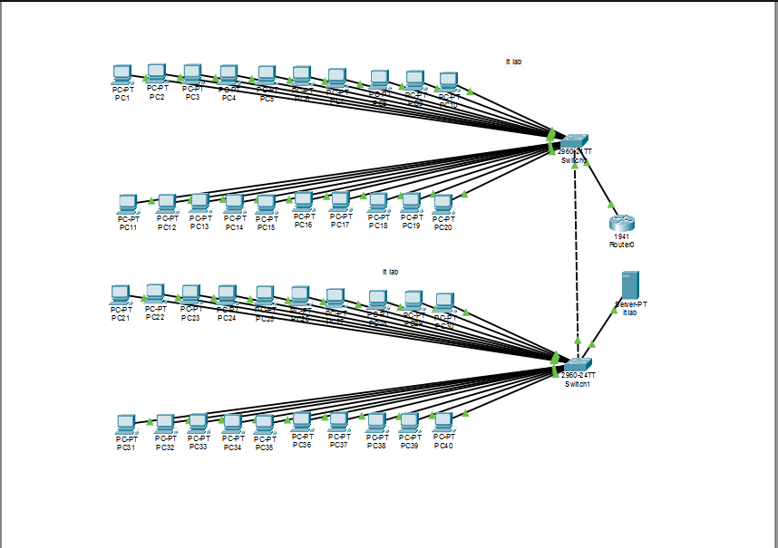
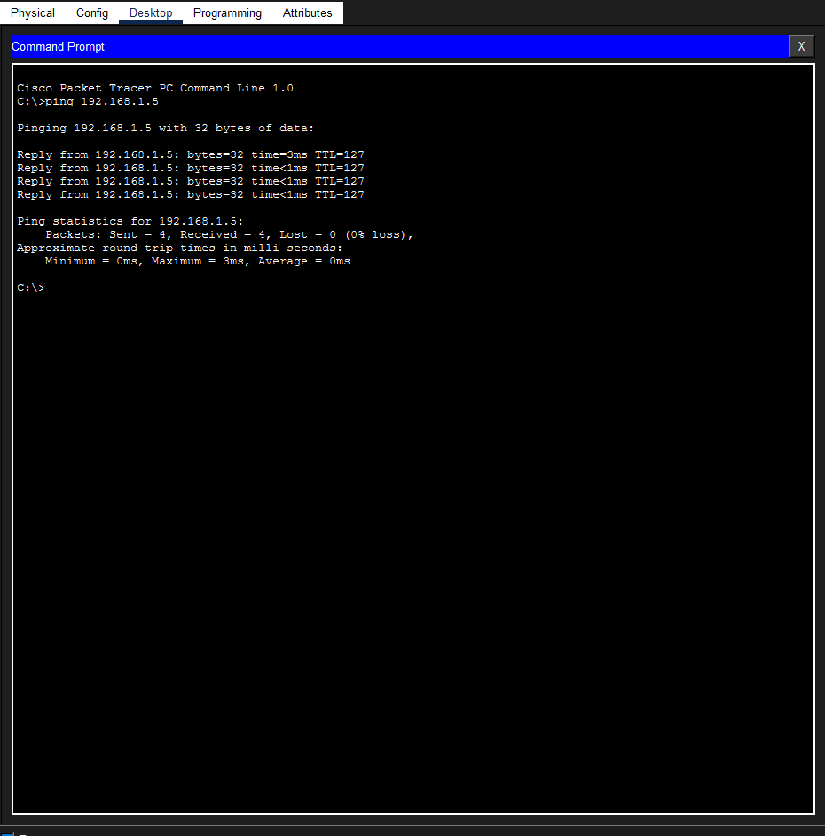

# 🌐 University Department Network Simulation 🎓

This project is a comprehensive network design and simulation for a University Department, developed using **Cisco Packet Tracer**. It focuses on creating a secure, scalable, and efficient infrastructure.

---

## 📸 Network Visualization

### 1️⃣ Full Network Topology
This is the complete architecture of the department, connecting all sections through a central routing system.  

### 2️⃣ IT Laboratory Setup
A closer look at the IT Lab configuration, which houses the department's central server.  

### 3️⃣ Connectivity Testing (Ping Results)
Verification of the network's functionality. This shows successful communication between a client PC and the Central Server.  

---

## 🚀 Project Overview
The simulation represents a modern campus network with specialized zones for different academic and administrative activities.

### 🏢 Network Sections:
* **Admin Office (VLAN 10):** Secure wired network for administrative staff.
* **IT Lab (VLAN 20):** High-performance network featuring a **Centralized Server** (`192.168.1.5`).
* **Study Area / Library (VLAN 30):** Wireless Connectivity for student laptops via Access Points.
* **Lecture Hall (VLAN 40):** Dedicated network for multimedia and teaching equipment.

---

## 🛠️ Technical Implementation
* **Inter-VLAN Routing:** Enabled via **Router 2** using sub-interfaces for efficient traffic flow.
* **Wireless Networking:** Implemented using **WMP300N** cards and Access Points.
* **Network Expansion:** Used **HWIC-4ESW** modules to overcome hardware port limitations.
* **Services:** Fully functional **DHCP** for automated IP management.

---

## 👨‍💻 Developer
**Oshadha Dhananjaya** *BICT Undergraduate | Faculty of Technology* *Rajarata University of Sri Lanka*

---

## 🛡️ License
Educational purpose only. Feel free to use this as a reference for your networking projects!
